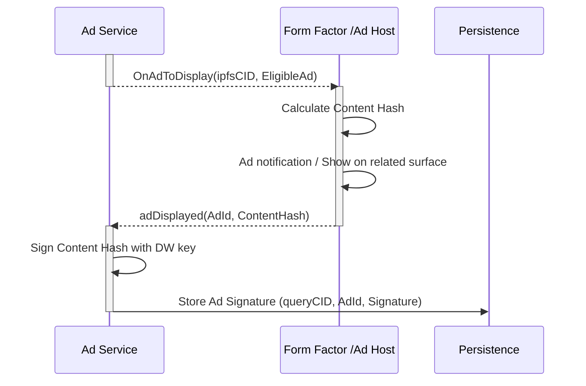
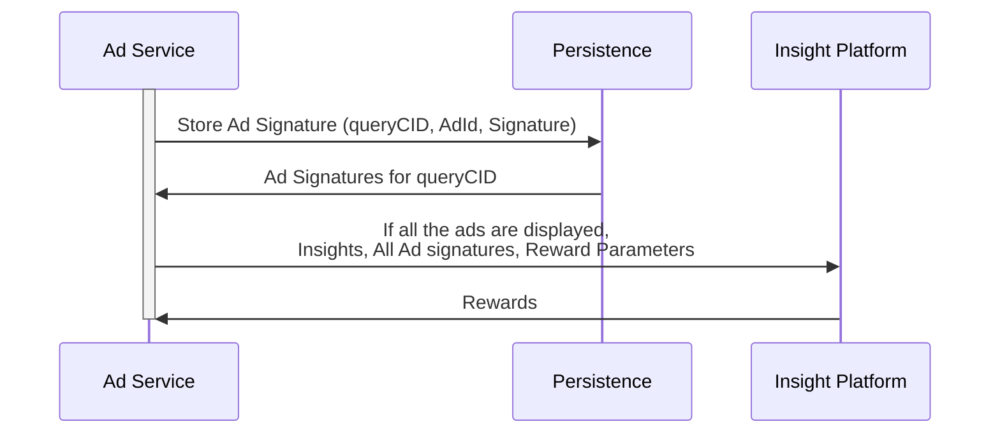

# Components

1. **Ad Host**: Some client that hosts some surfaces to show an ad. The browser extension is a host.
2. **Business**: Whoever wants to show ads
3. **Ad Surface**:  a generic place where ads are displayed. Could be a space on your website (like AdSense ads), or an interstitial marker in a video, or a billboard
4. **Surface Registry**: We issue a token to each AdSurface, which would need to, perhaps, stake token, in order to be listed as an AdSurface. The registry holds the tokens and issues surface ids.

So, once a DataWallet detects an ad surface, it would look in it's cached inventory of ads, and see if there is anything that fits that ad surface. It would transmit the ad to the surface, which would display it, and signatures would be collected all around.The Ad Surface would get money from the Consent Contract by trading the signatures, while the Data Wallet would get a signature for watching the ad, that it can trade for a reward

## Data Wallet Ad flows
### Data Wallet: Ad flow with notification/surface based flow

### Data Wallet: Ad Reporting
