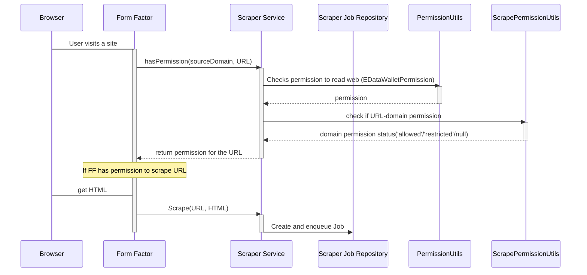

# Architecture

Process

```mermaid
sequenceDiagram

participant U as Browser
participant FF as Form Factor
participant SS as Scraper Service
participant SSJR as Scraper Job Repository

U->FF: User visits a site
activate FF

    FF->>SS: hasPermission(sourceDomain, URL)
    activate SS

        SS->>PermissionUtils: Checks permission to read web (EDataWalletPermission)
        activate PermissionUtils
            PermissionUtils -->> SS: permission
        deactivate PermissionUtils

        SS->>ScrapePermissionUtils: check if URL-domain permission
        activate ScrapePermissionUtils
            ScrapePermissionUtils-->>SS: domain permission status('allowed'/'restricted'/null)
        deactivate ScrapePermissionUtils
        SS-->>FF: return permission for the URL

    deactivate SS

    note over FF: If FF has permission to scrape URL
    FF->U: get HTML
    FF->>SS: Scrape(URL, HTML)
    activate SS
        SS->>SSJR: Create and enqueue Job
    deactivate SS

deactivate FF

```
