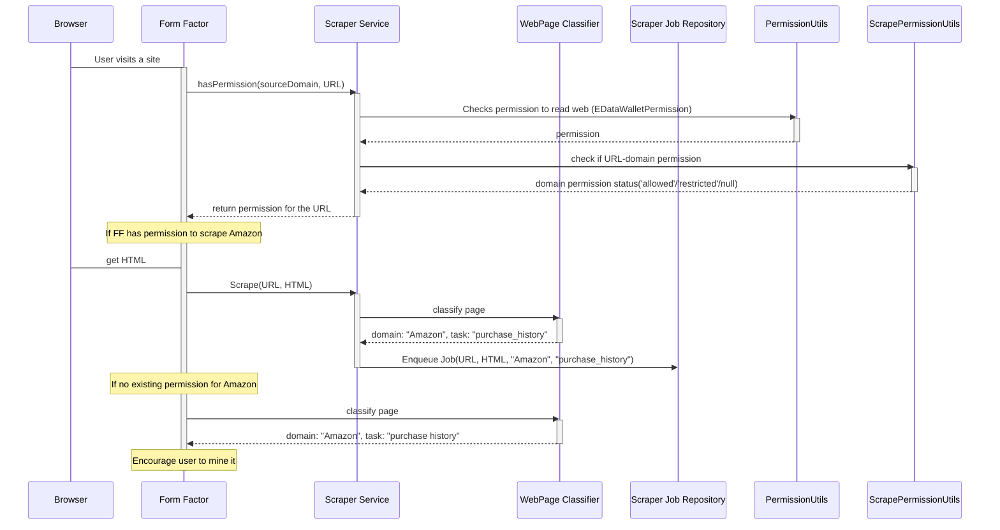
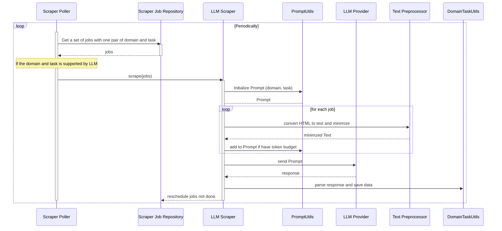

# Requirement

1. Different URL has different types of data, e.g., purchase history, products, discord, twitter, games, etc.
2. First problem is classifying URL to specific domain/platform (Amazon, Twitter, Epic Games)
3. Second problem is classifying URL to specific task processor (games, products, purchase history, search keywords, twitter followers, twitter interests, discord servers)
4. We want new domain scrapers to be pluggable.
5. We want new task processor to be pluggable and reusable(!).

# Architecture

Process

In this process, we assume the user visits **Amazon Order History** page.

**Step 1. Check the permission for the domain and the task**

**Step 2. Executing the domain and the task**

## Implementation Tech

1. Web-workers
2. IPFS to collect URLs?
