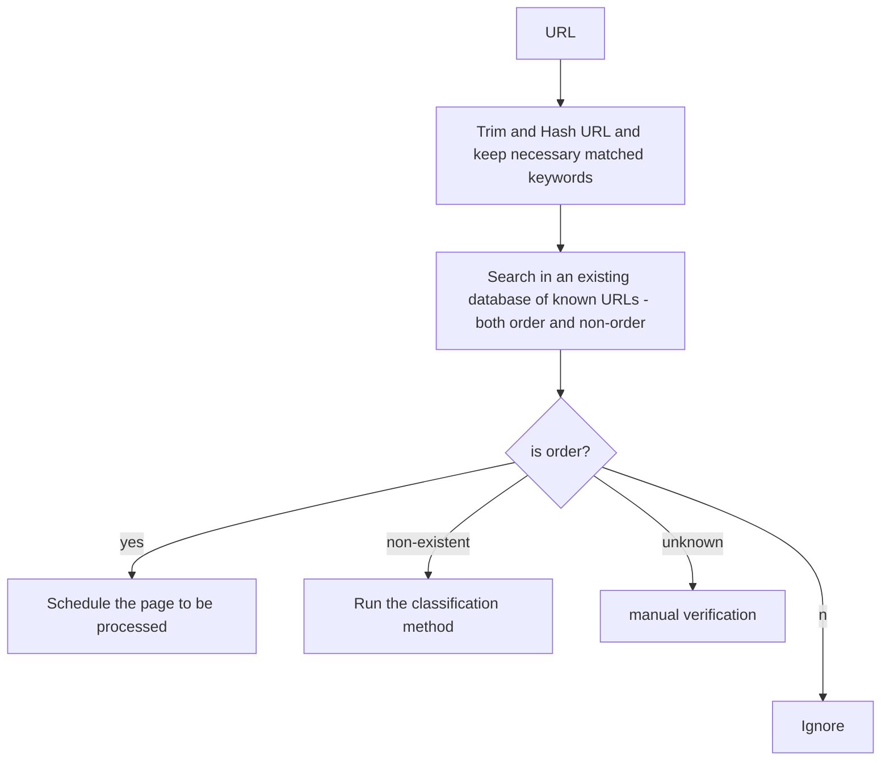
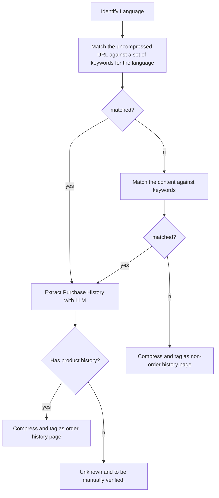

# URL matching based solution

Amazon in US:

1. https://www.amazon.com/gp/css/order-history
2. https://www.amazon.com/gp/your-account/order-history

Walmart:

1. https://www.walmart.com/orders

Epic Games:

1. https://www.epicgames.com/account/transactions

Ebay:

1. https://www.ebay.com/mye/myebay/v2/purchase

Steam:

1. https://store.steampowered.com/account/history/

BestBuy:

1. https://www.bestbuy.com/purchasehistory/purchases

Hepsiburada

1. https://www.hepsiburada.com/siparislerim (Turkey)

## Issues:

**True Negatives**

1. Any change in the URL will result in mis-identification
2. URLs may also changed based on geographical location.

**Technocal Issues**

1. We need to build a database of such URLs (feasible only for major platforms, may not find niche markets)

# Keywords-based matching

1. Detect Language
2. Keywords: Order, Order History, transaction, transaction history, #of dates,
3. Search in URL. If there is a match, search in the body to extract some products. If we cannot extract anything, then it's undecided.

## Issues:

**True Negatives**

1. Different Languages
2. Missing keywords

**False Positives**

1. Matched Keywords, but not a order history page (e.g., create order page)

## Flow

### Step 1: Match against known URLs

### Step 2: Classify Unknown URL

## URL State

1. order_history_page : verified order history page
2. non_order_history_page: verified non order page (like create order)
3. unknown: cannot be verified automatically, need human intervention.
