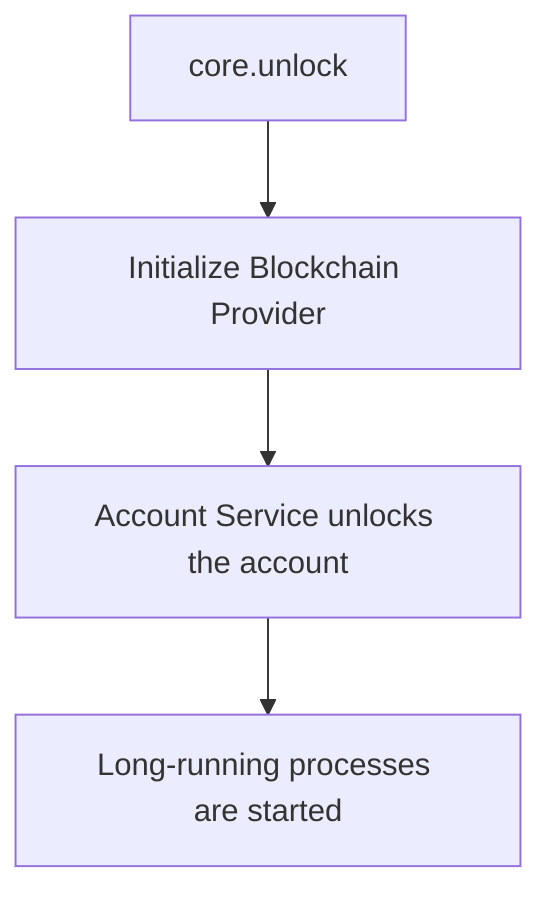

This document describes how core initializes and runs services.

## Initialization
The initialization of the core starts with an unlock request. It requires an account address, a signature, the language code, and the chain associated with the account address. It does 3 things:
1. Initialize the blockchain provider.
2. Unlock the account service
3. Start the long-running processes.
    i. accountIndexerPoller
    ii. blockchainListener

## Long running processes
A long-running process should be started in the **core.unlock** process. The long-running process should be initiated in the **initialize** method of a service. Refer to [BlockchainListener](/packages/core/src/implementations/api/BlockchainListener.ts) for example. A long running process is a method set to run at intervals.

