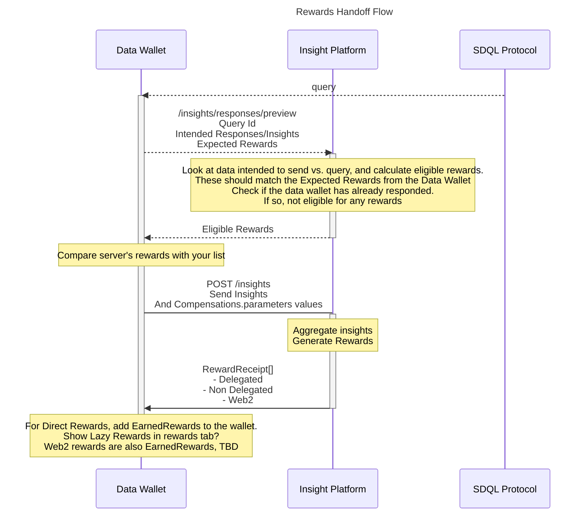

# Handoff-protocol


## Suggested changes in query schema
```
  "compensations":{
    
        "parameters": {
            "recipientAddress": {
                type:...,
                required: true
            },
            "productId": {
                type: string,
                required: true,
                values: [urls]
            },
            "shippingAddress": {
                type: string,
                required: true,
            },

        },
        "c1":{
            "description": "10% discount code for Starbucks",
            "chainId": 1,
            "callback": {
                "parameters": [
                    "recipientAddress"
                ],
                "data": {...an object to be forwarded with the api call}
            }
        },
        "c2":{
            "description": "participate in the draw to win a CryptoPunk NFT",
            "chainId": 1,
            "callback": {
                "parameters": [
                    "recipientAddress",
                    "productId"
                ],
                "data": {...an object to be forwarded with the api call}
            }
        },
        "c3":{
            "description": "a free CrazyApesClub NFT",
            "chainId": 1,
            "callback": {
                "parameters": [
                    "recipientAddress",
                    "shippingAddress"
                ],
                "data": {...an object to be forwarded with the api call}
            },
            "alternatives": [
                "c4",
                "c5"
            ]
            
        },
        "c4":{
            "description": "a free CrazyApesClub NFT on Avalanche",
            "chainId": 43114,
            "callback": {
                "parameters": [
                    "recipientAddress",
                    "shippingAddress"
                ],
                "data": {...an object to be forwarded with the api call}
            },
            "alternatives": [
                "c3",
                "c5"
            ]
            
        },
        "c5":{
            "description": "a free CrazyApesClub NFT on Solana",
            "chainId": -1,
            "callback": {
                "parameters": [
                    "recipientAddress",
                    "shippingAddress"
                ],
                "data": {...an object to be forwarded with the api call}
            },
            "alternatives": [
                "c3",
                "c4"
            ]
            
        },
    },
```

## Eligible Rewards
Represents the rewards that the Insight Platform thinks a data wallet is eligible for. Data wallet needs to check description of each reward.
```
{
    "c1":{
        "description": "10% discount code for Starbucks"
    },
    "c3":{
        "description": "a free CrazyApesClub NFT",
    },
}
```

## Alternatives
The one reward may be claimed on different chains. So, compenstations can have alternatives (example, "c3"). Users can claim the compenstation, "c3", or one of the alternatives, "c4", "c5".

## EarnedRewards
There can be three types of earned rewards after a data wallet has posted the insights
1. Direct rewards: Web3 rewards generated by the Insight Platform. Transaction receipts are sent back to the Data Wallet. Goes into the **claimed rewards tab/history**.
2. Lazy rewards: Signed transaction objects generated by the Insights Platform and are sent back to the Data Wallet. Data wallet can do a lazy transaction to claim them. Goes to the **earned rewards tab/history**. When the Data Wallet completes a lazy transaction, the related reward **moves** to the claimed rewards tab/history.
3. Web2 rewards: Web2 rewards can be anything identified by a JWT-like token. It will potentially have a URL and a token which will be sent back to the Data Wallet, and goes into the earned rewards tab/history. The Data Wallet can visit the URL and claim it.

```
[
    {
        cid: '..'
        compensationId: 'c1',
        type: Web2Reward
        data: {
            url:...,
            token:...
        }
    },
    {
        cid: '..'
        compensationId: 'c2',
        type: LazyReward
        data: {
            transactionReceipt: ....
        }
    },
    {
        cid: '..'
        compensationId: 'c3',
        type: DirectReward
        data: ..signed data..
    }
]
```