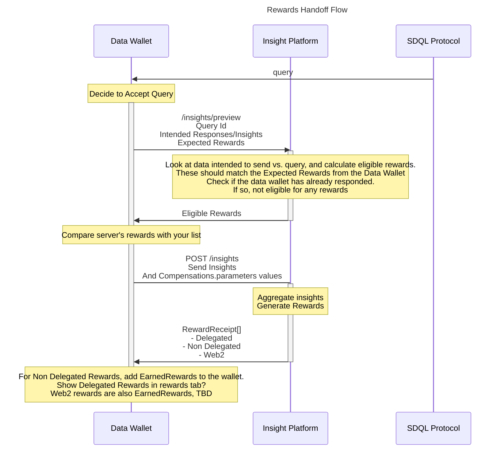

# Handoff-protocol


## Suggested changes in query schema
```
  "compensations":{
        "c1":{
            "description": "10% discount code for Starbucks",
            "callback": "https://web2api/"
        },
        "c2":{
            "description": "participate in the draw to win a CryptoPunk NFT",
            "callback": "https://reward-api",
            "parameters": {
                "recipientAddress": {
                    type:...,
                    required: true,
                    mappedType: "walletAddress"
                },
                "productId": {
                    type: number,
                    required: true,
                    values: [urls]
                    mappedType: "productId"
                },
                "shippingAddress": {
                    type: string,
                    required: true,
                    mappedType: "shippingAddress"
                },
                "param1": type,

            },
          "return": {
               "cid": ipfs id,
               "compensationId": "c2",
               "data": .....request related data
        },
        "c3":{
            "description": "a free CrazyApesClub NFT",
            "callback": "https://reward-api",
            "parameters": {
                "recipientAddress": {
                    type:...,
                    required: true,
                    mappedType: "walletAddress"
                },
                "param1": type,
                "param2": type

            },
          "return": {
               "cid": ipfs id,
               "compensationId": "c2",
               "data": .....request related data
        }
    },
```