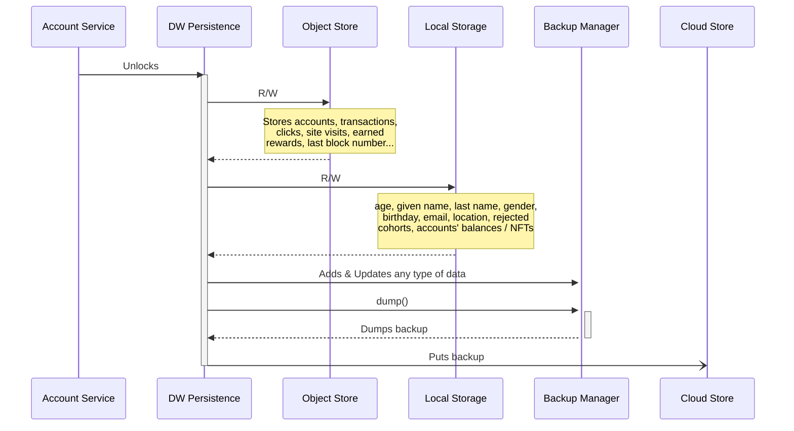

# Persistence Layer

This layer technically acts as the repository for personal off-chain data belonging to the end-user, and on-chain data about the linked accounts, their balances, NFTs, transactions, etc. 

All this data is stored locally (in memory) at the client side, and persistence package saves incremental backups on a cloud storage (which is Ceramic in our case). 

Each different type of data is represented with a key name.

Please note that data objects must be string serializable to be handled by this layer.

---

The package is driven by [DataWalletPersistence.ts](/packages/persistence/src/DataWalletPersistence.ts), which must be **unlocked** after the data wallet's derived key is determined.
After being unlocked, addAccount() can be called to store additional accounts (and on-chain data coming with them) in the persistence layer.

[DataWalletPersistence.ts](/packages/persistence/src/DataWalletPersistence.ts) works with the following classes / interfaces to manage storage & backups of corresponding data.
1. [IStorageUtils.ts](/packages/utils/src/IStorageUtils.ts)
    - Stores web2 and web3 user data including age, given name, family name, gender, birthday, email, location, account balances & NFTs, ...
    - Implemented by [LocalStorageUtils.ts](/packages/utils/src/LocalStorageUtils.ts)
        - In-memory key-value pairs
    - Updates to this set of data are commited to cloud storage, meaning old values will still persist but won't be returned to user.
2. [IVolatileStorageFactory.ts](/packages/persistence/src/volatile/IVolatileStorageFactory.ts)
    - Stores linked accounts, earned rewards, clicks, site visits, EVM transactions, ...
    - Implemented by [IndexedDB.ts](/packages/persistence/src/volatile/IndexedDB.ts)
        - Uses "objects stores" rather than tables
        - Each type of data is stored as a separate object store, having their own data cursors
        - Supports indexing on the object stores for fast search capability
3. [BackupManager.ts](/packages/persistence/src/backup/BackupManager.ts)
    - Keeps record of updates / writes on all data
    - Periodically dumps these records as blob wrapped with metadata, to be sent to cloud storage
4. [ICloudStorage.ts](/packages/persistence/src/cloud/ICloudStorage.ts)
    - To putBackup() and pollBackups()
    - Implemented by [CeramicCloudStorage.ts](/packages/persistence/src/cloud/CeramicCloudStorage.ts)
    
---

