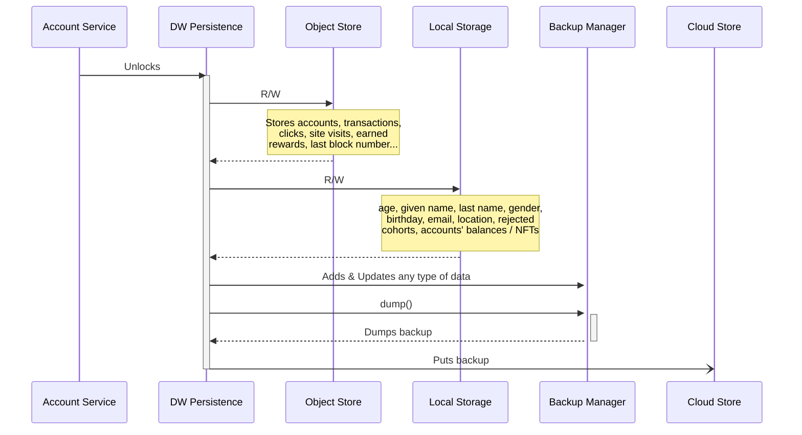

# Data Modeling Steps
Each new type of entity is stored in its object store (analogous to a table or collection) and each new field for the user is saved in the user object store. In the API, the table names corresponds to the name of the object store. The steps are explained with a new entity called "Animal" for which we need a new object store in the database. For this example we will NOT use an auto-increment id.

1. First, we define the name of the object store in [ERecordKey.ts](./../../packages/persistence/src/ELocalStorageKey.ts). The name of the object store will be "SD_ANIMAL". So, we add an enum in ERecordKey, (ERecordKey.ANIMAL, "SD_ANIMAL").
2. Second, we add the required version-related members in the **Animal class** by extending the VersionObject class, and create the **AnimalMigrator** class that converts records from the store into our animal objects.

```
    export class Animal extends VersionedObject {
        public static CURRENT_VERSION = 1;

        public constructor(id: number, name: string) {
            super();
        }

        public getVersion(): number {
            return DiscordProfile.CURRENT_VERSION;
        }
    }
```

We add the migrator definition to the same file where we defined the Animal class

```
    export class Animal extends VersionedObject { ... }

    export class AnimalMigrator extends VersionedObjectMigrator<Animal> {
        public getCurrentVersion(): number {
            return Animal.CURRENT_VERSION;
        }

        protected factory(data: Record<string, unknown>): Animal {
            return new Animal(
                data["id"],
                data["name"]
            );
        }

        protected getUpgradeFunctions(): Map<
            number,
            (data: Record<string, unknown>, version: number) => Record<string, unknown>
        > {
            return new Map();
        }
    }
```
3. Every entity requires a schema which is analogous to table definitions in SQL. We add the schema to [VolatileStorageSchema.ts](./../../packages/persistence/src/volatile/VolatileStorageSchema.ts) by adding an object of type [VolatileTableIndex](./../../packages/persistence/src/volatile/VolatileTableIndex.ts). 
```
  new VolatileTableIndex(
    ERecordKey.ANIMAL, // The name of our object store / table
    "id", // primary key field.
    false, // false disables the auto-increment key generator. 
    new AnimalMigrator(), // migrator that our database client will use to convert data into animal objects.
  ),

```


4. (Optional) To create indices, we supply a array of field names with uniqueness flag. It's possible to create an index on multiple attributes.

```
  new VolatileTableIndex(
    ERecordKey.ANIMAL, // The name of our object store / table
    "id", // primary key field.
    false, // false disables the auto-increment key generator. 
    new AnimalMigrator(),
    [['name', false], ['someOtherField', false], [['comp1', 'comp2'], true]
  ),


```

5. Accessing the store: The store is access through the interface of [IDataWalletPersistence](./../../packages/core/src/interfaces/data/utilities/IDataWalletPersistence.ts). It supports basic CRUD methods. Here goes the sample repository methods to access our animal data:

In the examples, **this.persistence** is an instance of DataWalletPersistence. All the update methods need a backup priority flag either as a parameter or an attribute of the object. 
**Add an animal**: We add a new object to the store by wrapping it in a [VolatileStorageMetadata](./../../packages/objects/src/businessObjects/VolatileStorageMetadata.ts) object.
```
    const myDog = new Animal("XX12", "Tom");
    const metadata = new VolatileStorageMetadata<Animal>(
        EBackupPriority.NORMAL,
        myDog,
        Animal.CURRENT_VERSION,
    );
    return this.persistence.updateRecord(ERecordKey.ANIMAL, metadata);
```

**Update an animal**: Update works exactly the same way as adding a new object. The engine will update and existing object if an object with the same primary key exists.

**Delete an animal**: Current we only support deleting by the primary key. The value of the primary key needs to be wrapped in a [VolatileStorageKey](./../../packages/objects/src/primitives/VolatileStorageKey.ts) object.

```
    return this.persistence.deleteRecord(ERecordKey.ANIMAL, VolatileStorageKey("XX12"), EBackupPriority.NORMAL); // Deletes Tom from the animal store.
```

**Find an animal by primary key**:
```
    return this.persistence.getObject(ERecordKey.ANIMAL, VolatileStorageKey("XX12"), EBackupPriority.NORMAL); // Deletes Tom from the animal store.
```

**Get all animals**:
```
    return this.persistence.getAll(ERecordKey.ANIMAL);
```
**Get all primary keys**:
```
    return this.persistence.getAllKeys(ERecordKey.ANIMAL);
```

**Get cursor**:
Cursors can return all the objects or a subset matching an index field. For details, please check [IndexDB](https://developer.mozilla.org/en-US/docs/Web/API/IndexedDB_API/Using_IndexedDB) document.
```
    return this.persistence.getCursor(ERecordKey.ANIMAL, "name", IDBValidKey("Tom")); // will return a cursor with all the Toms. 
```


# Internal Architecture

This layer technically acts as the repository for personal off-chain data belonging to the end-user, and on-chain data about the linked accounts, their balances, NFTs, transactions, etc. 

All this data is stored locally (in memory) at the client side, and persistence package saves incremental backups on a cloud storage (which is Ceramic in our case). 

Each different type of data is represented with a key name.

Please note that data objects must be string serializable to be handled by this layer.

---

The package is driven by [DataWalletPersistence.ts](/packages/persistence/src/DataWalletPersistence.ts), which must be **unlocked** after the data wallet's derived key is determined.
After being unlocked, addAccount() can be called to store additional accounts (and on-chain data coming with them) in the persistence layer.

[DataWalletPersistence.ts](/packages/persistence/src/DataWalletPersistence.ts) works with the following classes / interfaces to manage storage & backups of corresponding data.
1. [IStorageUtils.ts](/packages/utils/src/IStorageUtils.ts)
    - Stores web2 and web3 user data including age, given name, family name, gender, birthday, email, location, account balances & NFTs, ...
    - Implemented by [LocalStorageUtils.ts](/packages/utils/src/LocalStorageUtils.ts)
        - In-memory key-value pairs
    - Updates to this set of data are commited to cloud storage, meaning old values will still persist but won't be returned to user.
2. [IVolatileStorageFactory.ts](/packages/persistence/src/volatile/IVolatileStorageFactory.ts)
    - Stores linked accounts, earned rewards, clicks, site visits, EVM transactions, ...
    - Implemented by [IndexedDB.ts](/packages/persistence/src/volatile/IndexedDB.ts)
        - Uses "objects stores" rather than tables
        - Each type of data is stored as a separate object store, having their own data cursors
        - Supports indexing on the object stores for fast search capability
3. [BackupManager.ts](/packages/persistence/src/backup/BackupManager.ts)
    - Keeps record of updates / writes on all data
    - Periodically dumps these records as blob wrapped with metadata, to be sent to cloud storage
4. [ICloudStorage.ts](/packages/persistence/src/cloud/ICloudStorage.ts)
    - To putBackup() and pollBackups()
    - Implemented by [CeramicCloudStorage.ts](/packages/persistence/src/cloud/CeramicCloudStorage.ts)
    
---



