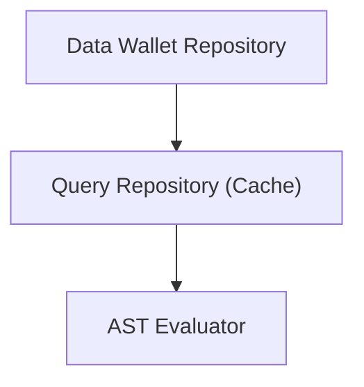
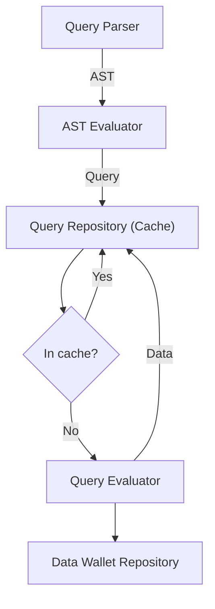

# Query Execution Plan

## Data Flow

```mermaid

graph TD;
    DW["Data Wallet Repository"]-->QR["Query Repository #40;Cache#41;"];
    QR-->ASTE["AST Evaluator"];
    
```

## Process


```mermaid
flowchart TD;
    QP["Query Parser"]--AST-->ASTE["AST Evaluator"]--Query-->QR["Query Repository #40;Cache#41;"];
    QR --> Cache{"In cache?"}
    Cache -- Yes --> QR
    Cache -- No --> QEVAL["Query Evaluator"] --> DW["Data Wallet Repository"]
    QEVAL --Data --> QR
```


## AST

### Examples
**if($q1and$q2and$q3)then$r1else$r2**

<!-- EXPR -> IF COND THEN EXPR ELSE EXPR
```mermaid
graph TD;
    IF-->


``` -->
