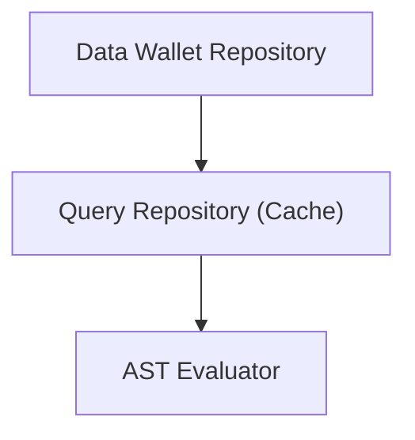
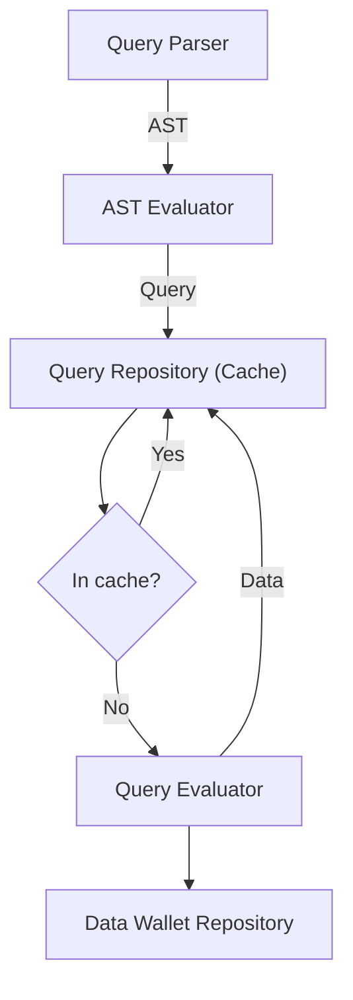
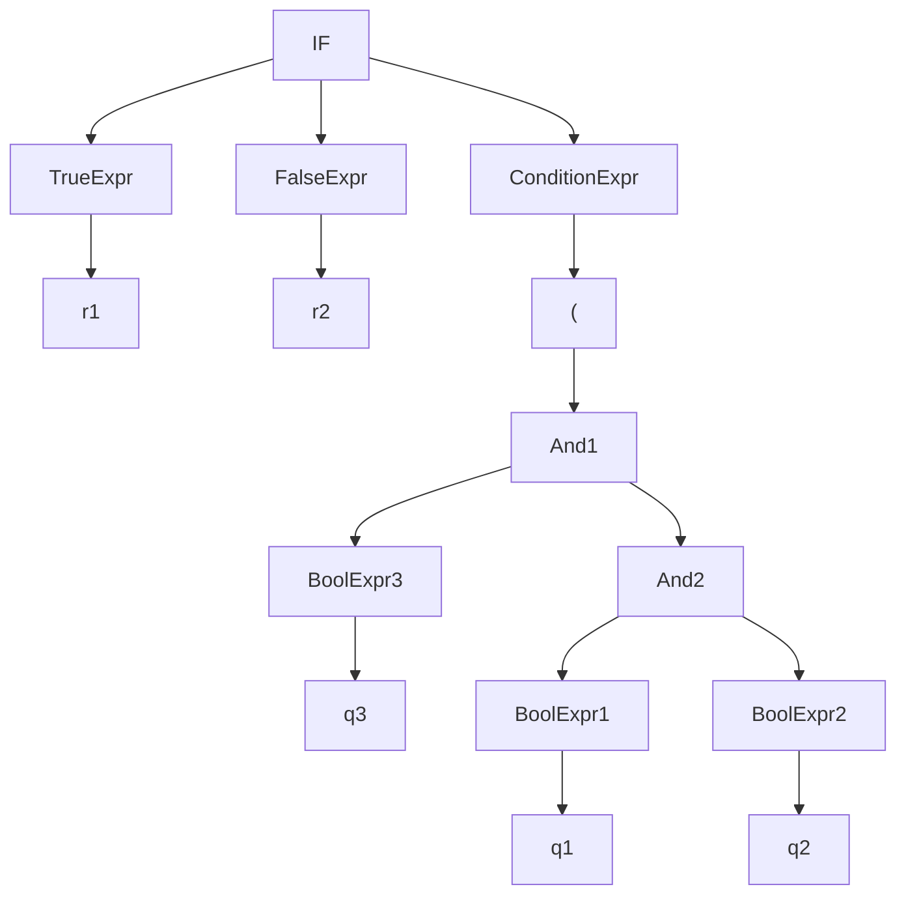

# Query Execution Plan

## Data Flow

## Process

## AST

### Examples
1. **if($q1and$q2and$q3)then$r1else$r2**

<!-- EXPR -> IF COND THEN TrueExpr ELSE FalseExpr -->

We traverse the tree in post-order (evaluate children first in any order).
