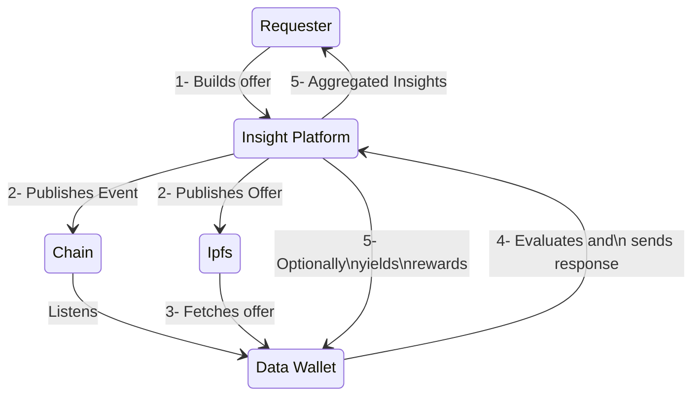
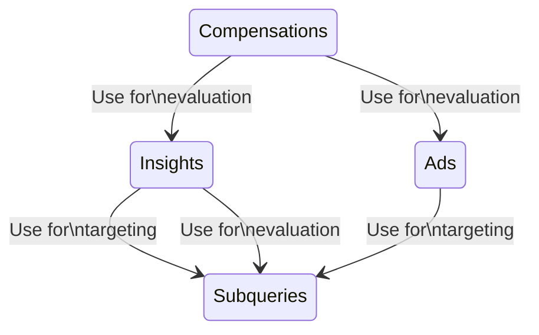

[Note]: <> (
  This readme assumes reader knows why Synamint protocol exists, its capabilities, and roughly how it works.
)

[Note]: <> (
  This readme is not supposed to talk about the place of offer files in Snickerdoodle's overall business flow, but rather explain their purpose
)

# Introduction

Businesses can interact with audiences for various purposes like gathering insights, targeting ads, and distributing rewards, potentially in exchange of some data or effort. A **Synamint offer** is a JSON declaration of such interactions that a business is willing to make with an audience of data wallets. Synamint offers are the on-chain means of one-way communication from requesters to the data wallets.


# Examples

Following offer asks if "people who are older than 30 years of age have interacted with Uniswap".

```JSON
{
  "version": 0.1,
  "timestamp": "2021-11-13T20:20:39Z",
  "expiry": "2023-11-13T20:20:39Z",
  "description": "Todd is a nerd",
  "business": "CryptoCowboys",
  "insights": {
    "i1": {
      "name": "Do the elderly know the deal?",
      "conditions": "$age > 30",
      "returns": "$tx(uniswap)"
    }
  }
};
```

Following offer doesn't ask any questions, and just yields an NFT to every data wallet subscribed to their campaign.

```JSON
{
  "version": 0.1,
  "timestamp": "2021-11-13T20:20:39Z",
  "expiry": "2023-11-13T20:20:39Z",
  "description": "Apollo is generous",
  "business": "Ancient Greece",
  "compensations": {
    "c1": {
      "name": "Bread NFT",
      "requires": "true",
      "image": "33tq432RLMiMsKc98mbKC3P8NuTGsMnRxWqxBEmWPL8wBQ",
      "description": "Gives a low-quality boost to energy. Common.",
      "chainId": 1,
    }
  }
};
```

Following offer combines the previous offers in one offer to give the reward only to people older than 30

{
  "version": 0.1,
  "timestamp": "2021-11-13T20:20:39Z",
  "expiry": "2023-11-13T20:20:39Z",
  "description": "Apollo is generous",
  "business": "Ancient Greece",
  "insights": {
    "i1": {
      "name": "Do the elderly know the deal?",
      "conditions": "$age > 30",
      "returns": "$tx(uniswap)"
    }
  },
  "compensations": {
    "c1": {
      "name": "Bread NFT",
      "requires": "$i1",
      "image": "33tq432RLMiMsKc98mbKC3P8NuTGsMnRxWqxBEmWPL8wBQ",
      "description": "Gives a low-quality boost to energy. Common.",
      "chainId": 1,
    }
  }
};

# Actors

Synamint offers are meant to be created by businesses, influencers, political parties, etc; using a registered insight platform. Insight platforms may come with different offer-building mechanisms depending on their implementation, as long as the resulting offer file is valid.

Consumers of the offers are the data wallets. The core library used by data wallets actively listens to the chain for occurances of **requestForData** events, which will contain an IPFS CID for the corresponding offer content. Core is also responsible for handling the Synamint offer, including fetching it, parsing it, evaluating it against user data, storing the targeted ads; and sending **responses** to an insight platform.





# Capabilities

Synamint offers are unidirectional, from requesters to data wallets. Responses of audiences of data wallets are meant to be aggregated and displayed to the requesters in a compact format.

An offer can represent any combination of asking provable questions on personal data, targeting ads to data wallets depending on user profile, and giving conditional or unconditional rewards to data wallets.

A synamint offer will be evaluated against raw user data at the client-side; but an answer to an offer, that is an insight, will never expose the raw data to outside of data wallet. Only the **proof** of user data, or user effort, is exposed.

# Components

Synamint offers consist of metadata and components. Components are the main elements of evaluation. They introduce a flexible data, effort, and value exchange mechanism between data wallets and businesses.

Components are namely [subueries](</documentation/sdql/components/SUBQUERIES.md>), [insights](</documentation/sdql/components/INSIGHTS.md>), [ads](</documentation/sdql/components/ADS.md>), and [compensations](</documentation/sdql/components/COMPENSATIONS.md>). Components have a clear topology among themselves, which directly determines the evaluation result combined with user data and effort.



## Components - Subqueries

Subqueries allow manipulation of end-user data at the client side. 

Following is a query that represents end users' unexposed age information.
```JSON
{
  "q1": {
    "name": "age",
    "return": "number"
  }
}
```

Subqueries are powerful because of their non-revealing nature alongside allowing data access capabilities. They make it possible to target specific users without costing privacy. Businesses can also combine different kinds of queries in an offer to accomplish data manipulation at the client side without seeing the raw data.

## Components - Insights

An insight refers to user data manipulated at client side. Insights reference to a combination of subqueries to create different aggregations as insights.

Following is an insight block revaling how many people that have more than 10 ETH across their linked accounts are located in the US.
```JSON
{
  "i1": {
    "name": "age",
    "target": "$balance.ETH > 10",
    "returns": "$loc in ['US']",
  }
}
```

Insight blocks first "target" specific data wallets, and then "return" non-identifiable but insightful information from those data wallets. These "return"s are the main component of insights aggregation. 

## Components - Ads

Ads are not meant to be insightful, and they're closer in meaning to assignments. They declare information about an ad to be displayed to the end users: the content source, suitable surfaces to show the ad, and so on. 

Ads do "target" data wallets as well, and are similar to insight blocks in this regard.

Following is an ad block targeting people following more than 10K people. Data wallets without such a linked profile will not enqueue this ad in the first place.

```JSON
{
  "a1": {
    "name": "Walk towards a unified world!",
    "target": "$len($twitter.following) > 10000",
    "content": {
      "type": "video",
      "src": "ipfsHash, url, ...",
    },
    "displayType": "banner",
    //...
  }
}
```

Ads do not have "returns" like insights, hence, they do not contribute to insight aggregation. They represent "user effort" rather than "user data", and this is the main comparison between insights and ads.

## Components - Compensations


```JSON
{
  "c1": {
    "name": "The CryptoPunk Draw",
    "image": "33tq432RLMiMsKc98mbKC3P8NuTGsMnRxWqxBEmWPL8wBQ",
    "description": "participate in the draw to win a CryptoPunk NFT",
    "callback": {
      "parameters": ["recipientAddress", "productId"],
      "data": {
        "trackingId": "982JJDSLAcx",
      },
    },
  }
}
```


[TODO]: <> (
  Briefly introduce subq, insights, ads and compensations.
  Give very minimal examples.
)

[TODO]: <> (
  Include a flow diagram of these components.
)

[TODO]: <> (
  Include a more complex example.
)

