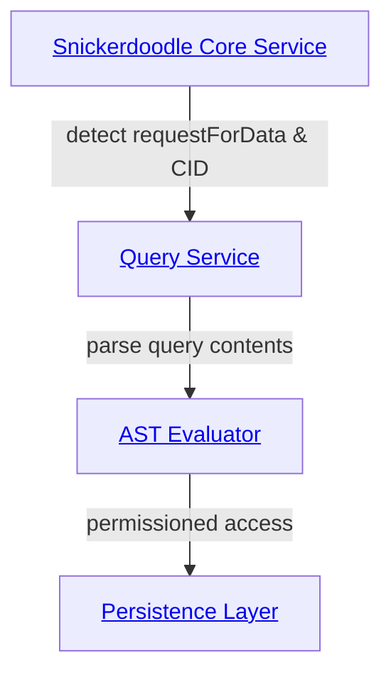
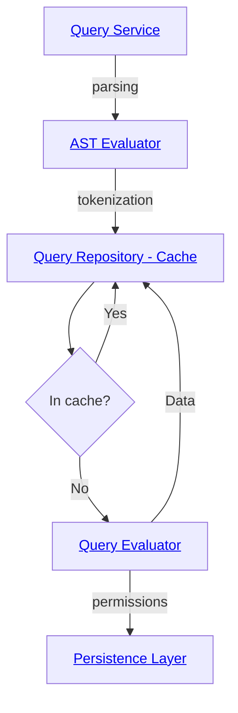
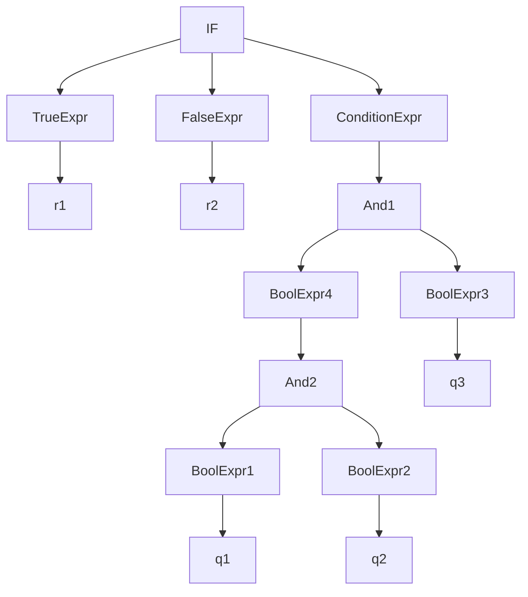

# Query Service

The [Query Service](packages\core\src\implementations\business\QueryService.ts) (QS) is an integral component of the Snickerdoodle Protocol 
[Core package](/packages/core/README.md). The QS responsible for processing queries emitted from consent contracts that the Data Wallet user has opted in to (i.e. the user's 
Data Wallet address has a non-zero balance in the associated consent contract). The primary components of the Query Service of interest to contributors are:

- [QueryService.ts](/packages/core/src/implementations/business/QueryService.ts)
- [QueryParsingEngine.ts](/packages/core/src/implementations/business/utilities/QueryParsingEngine.ts)
- [AST_Evaluators.ts](/packages/core/src/implementations/business/utilities/query/AST_Evaluator.ts)
- [QueryRepository.ts](/packages/core/src/implementations/business/utilities/query/QueryRepository.ts)
- [QueryEvaluator.ts](/packages/core/src/implementations/business/utilities/query/QueryEvaluator.ts)

## Data Flow

Processing a network query begins with the detection, by an instance of [`BlockchainLister`](packages\core\src\implementations\api\BlockchainListener.ts), of a `requestForData` 
event emitted from a consent contract. The event data includes an IPFS [CID](https://proto.school/anatomy-of-a-cid/01/) pointing to a [SDQL](/documentation/sdql/README.md) 
JSON file pinned to the IPFS network containing the query to be executed. The query CID is then passed into the Query Service via a call to `processQuery`. 

The call to `processQuery` then creates two separate abstract syntax tree (AST) objects based on the contents of the [`logic`](/documentation/sdql#logic) block: one for the SDQL 
[`returns`](/documentation/sdql#returns) block, and one for the [`compensations`](/documentation/sdql#compensations) block. Each of these blocks can themselves reference one or 
more [`query`](/documentation/sdql#queries) or [`compensation`](/documentation/sdql#compensations) definitions respectively. The ASTs are ultimately evaluated against the data 
wallet's [persistence layer](/packages/persistence/README.md) consistent with user-specified permissions, i.e. if a `query` specification requires access to the `location` 
attribute of a user, the user must have consented to this access by indicating their consent in the associated consent contract. 

Finally, after data has been accessed at the persistence layer level, the `processQuery` function delivers a cryptographically signed data payload, vai the `deliverInsights`
function to the aggregation url specified the query's SDQL JSON file. 

## Process - Schema to Execution

## AST

### Examples
1. **if($q1and$q2and$q3)then$r1else$r2**

We traverse the tree in post-order (evaluate children first in any order).

## Infix to Postfix expressions:

1. if(condition)thenTrueExpr --> condition, if, TrueExpr, then
2. if(condition)thenTrueExprElseFalseExpr --> condition, if, TrueExpr, then, FalseExpr, else
3. $q1and$q2 -> $q1,$q2,and
4. $q1and$q2or$q3 -> $q1,$q2,and,q3,or
5. ($q1and($q2or$q3)) -> $q1,$q2,q3,or,and
6. if$q1and$q2then$r1 -> $q1, $q2, and, if, $r1, then