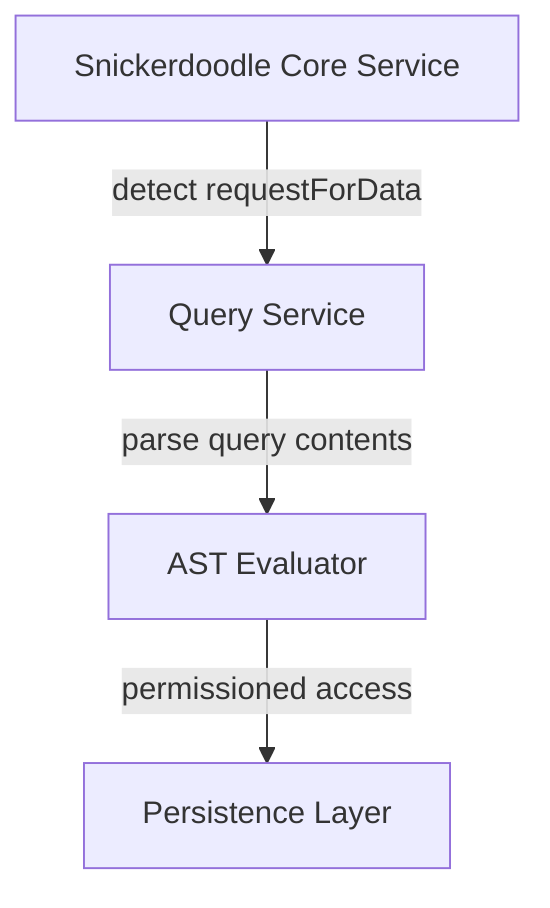
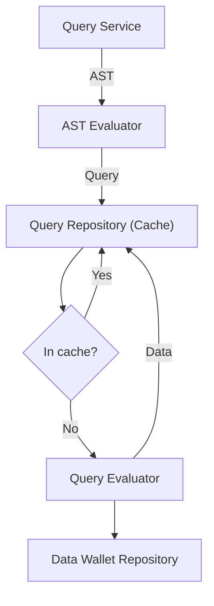
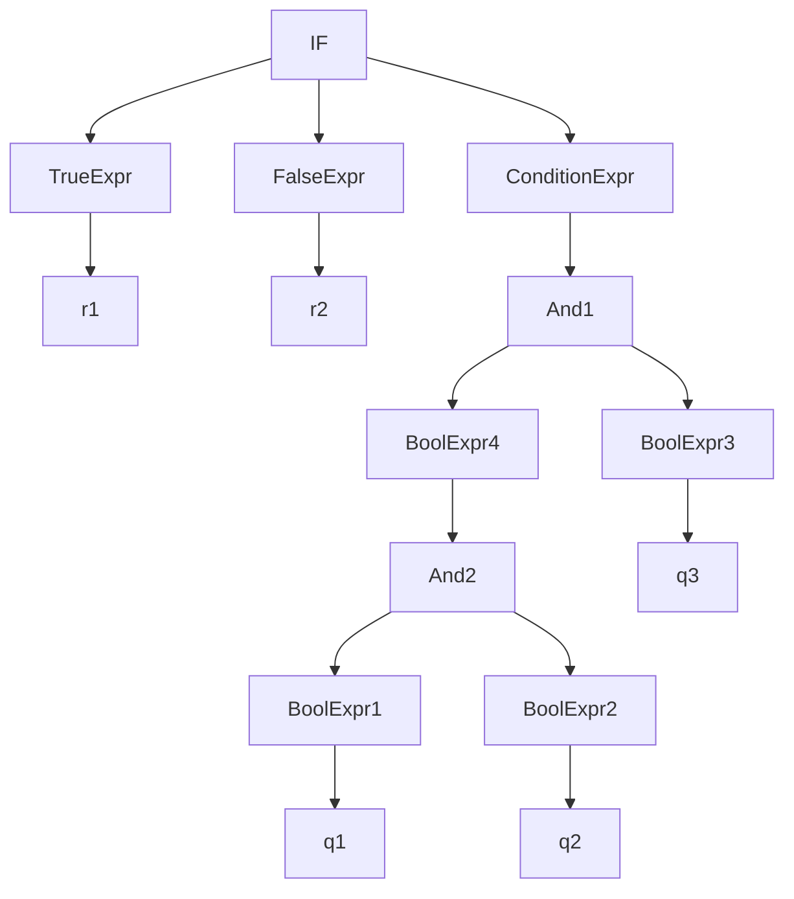

# Query Service

The Query Service (QS) is an integral component of the Snickerdoodle Protocol [Core package](/packages/core/README.md). The QS responsible for 
processing queries emitted from consent contracts that the Data Wallet user has opted in to (i.e. the user's Data Wallet address has a non-zero balance
in the associated consent contract). The primary components of the Query Service are as follows:

- [QueryService.ts](/packages/core/src/implementations/business/QueryService.ts)
- [QueryParsingEngine.ts](/packages/core/src/implementations/business/utilities/QueryParsingEngine.ts)
- [AST_Evaluators.ts](/packages/core/src/implementations/business/utilities/query/AST_Evaluator.ts)
- [QueryRepository.ts](/packages/core/src/implementations/business/utilities/query/QueryRepository.ts)
- [QueryEvaluator.ts](/packages/core/src/implementations/business/utilities/query/QueryEvaluator.ts)

## Data Flow

Processing a network query begins with the detection, by an instance of the core package, of a `requestForData` event emitted from a consent contract. The event data includes 
an IPFS [CID](https://proto.school/anatomy-of-a-cid/01/) pointing to a [SDQL](/documentation/sdql/README.md) JSON file on the IPFS network containing the query to be executed. 

The query CID is then passed into the Query Service via a call to `processQuery`. 

## Process - Schema to Execution

## AST

### Examples
1. **if($q1and$q2and$q3)then$r1else$r2**

We traverse the tree in post-order (evaluate children first in any order).

## Infix to Postfix expressions:

1. if(condition)thenTrueExpr --> condition, if, TrueExpr, then
2. if(condition)thenTrueExprElseFalseExpr --> condition, if, TrueExpr, then, FalseExpr, else
3. $q1and$q2 -> $q1,$q2,and
4. $q1and$q2or$q3 -> $q1,$q2,and,q3,or
5. ($q1and($q2or$q3)) -> $q1,$q2,q3,or,and
6. if$q1and$q2then$r1 -> $q1, $q2, and, if, $r1, then