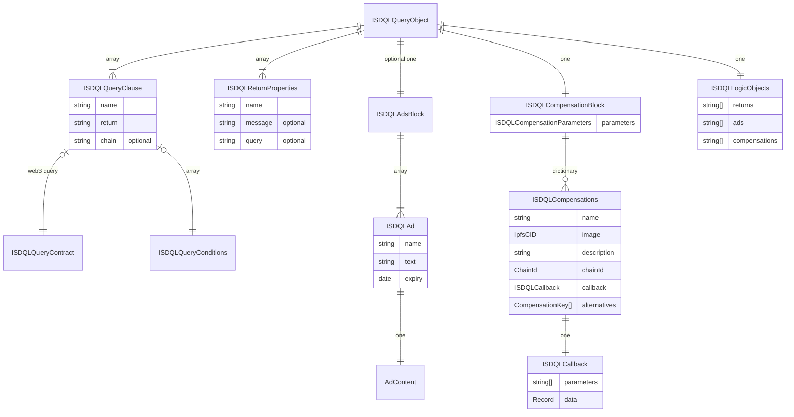

# Steps to add a new query support to the core:

1. Update the name section of [README.md](./README.md) file with new query name.
2. Update the [EXAMPLES.md](./EXAMPLES.md) file with new query schema examples and optionally define the new structures in [sdql-v0.0.1.schema](./sdql-v0.0.1.schema.json) if required.

## 1. Parsing the query
First step in the implementation is parsing the query and building the AST (Abstract Syntax Tree). This is done by the **Query Parser package**.

1. Parsing the new query requires an interface (we call them blocks) to be defined that resembles the query structure which will be a part of [**ISDQLQueryObject**](/packages/objects/src/interfaces/ISDQLQueryObject.ts). The [**SDQLParser**](/packages/query-parser/src/implementations/business/SDQLParser.ts) converts a query schema into AST. So, we need to define an AST element for the new query. 




### Creating the AST element


If your new query type fits one of the following interfaces, your new AST_* object must extend it. If it has no overlapping with the following interfaces, the new AST element must extend from **AST_Query**.

**AST_PropertyQuery** - Web2 components, including age, gender, most popular sites, etc.

**AST_Web3Query** - Web3 components, including transactions, account nfts, digital currency assets, etc.

2. You need to update the **SDQLParser** to convert the query block into the corresponding AST element. You can also write validations here. 

    ### Get the permission flag for the query
    Each query have a data permission flag. With the flag the end-user can restrict the execution of a specific type of queries. 

    1. Define a data type for the query in EWalletDataType.
    2. Define a getter for the data type in DataPermissions.
    3. Update the getQueryPermissionFlag of SDQLParser.

3. Once this is done, write tests and check if the parser can correctly build the AST.


## 2. Evaluating the query
Once we have the AST for a query, we can execute the logic expressions. The evaluators are in the **core package** (*packages/core/src/.../business/utilities/query*). You need to update the QueryEvaluator which wraps all the query-type specific evaluators. 

1. If you have a non-property query, update the **eval** method of the QueryEvaluator that calls the evaluator.
2. If you have a property query, update evalPropertyQuery.

## 3 Publishing the query-parser package to npm repository
1. The parser package is used by the insight platform as a third party npm package. We need to publish it to our company repository.

# An example - The Pet Query
Suppose we want to support a new query that collects the animal pets that an user may have. 

1. We first add the name "pet" to the names section of [README.md](./README.md) file with description "access to a list of pets that the user has"
2. Now we update two files with the schema and an example of the query

In [EXAMPLES.md](./EXAMPLES.md)
```json
    "q99": {
        "name": "pet",
        "return": "array",
        "conditions": {
            "type": "dogs"
        }
    }
```
In [sdql-v0.0.1.schema](./sdql-v0.0.1.schema.json), we do not need to update anything as we are not defining any new structures (The return structure is an object array).
### 1. Parsing the query
1. As this is a web2 data type and matches our abstractions, we can reuse the **ISDQLQueryClause** and **AST_PropertyQuery**. No need to define anything new.
2. Now we need to update the SDQLParser so that it can correctly parse the query. This query is too simple to write a validator for. But we need to set up data permissions

```typescript
// 1. Define EDataWalletType
export enum EWalletDataType {
    ...
    ...
    Pet = 22,
}

// 2. Getter of the permission.

export class DataPermissions {
    ...
    public get Pet(): boolean {
        return this.getFlag(EWalletDataType.Pet);
    }
    ...
}

// 3. Update the getQueryPermissionFlag of SDQLParser. We will update getPropertyQueryPermissionFlag as that wraps all the getters for property query permission


private getPropertyQueryPermissionFlag(query: AST_Query) {
    const propQuery = query as AST_PropertyQuery;
    switch (propQuery.property) {
        ...
        case "pet":
            return EWalletDataType.Pet;
        case "default":
        ...
    }
}

```
3. Now we should be able to unit test it and expect a property query object with name "q99" and property "pet". In our property query evaluator all we have to do is write the pet handler.

### 2. Evaluating the query

    1. Skipped as this is a property query
    2. Updating property query evaluator in QueryEvaluator

```typescript
public evalPropertyQuery(
    q: AST_PropertyQuery,
): ResultAsync<SDQL_Return, PersistenceError> {
    let result = SDQL_Return(true);
    switch (q.property) {
        ...
        case "pet": // get the data from persistence and transform if required.
             return this.dataWalletPersistence.getPets().andThen((pets) => {
                return okAsync(pets)
             });
        ...
    }
}
```


### 3 Publishing the query-parser package to npm repository
In this last step, we build the query-parser package and publish it to the npm repository. This step requires repository authentication and we skip it for our pet example.


