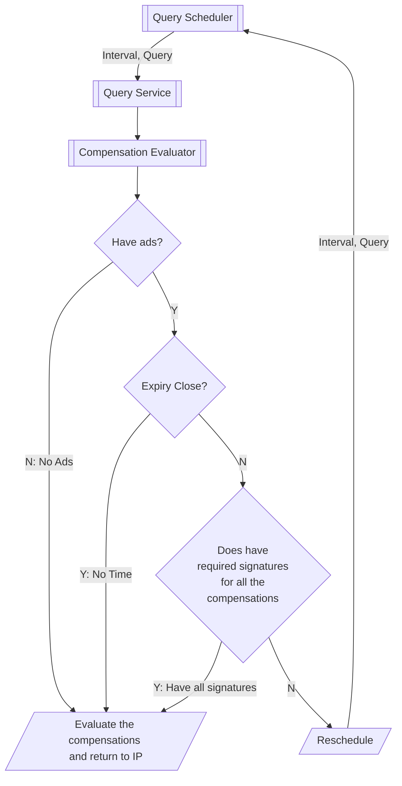
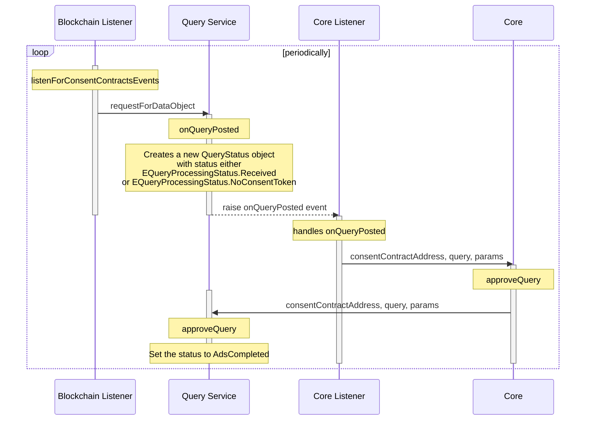
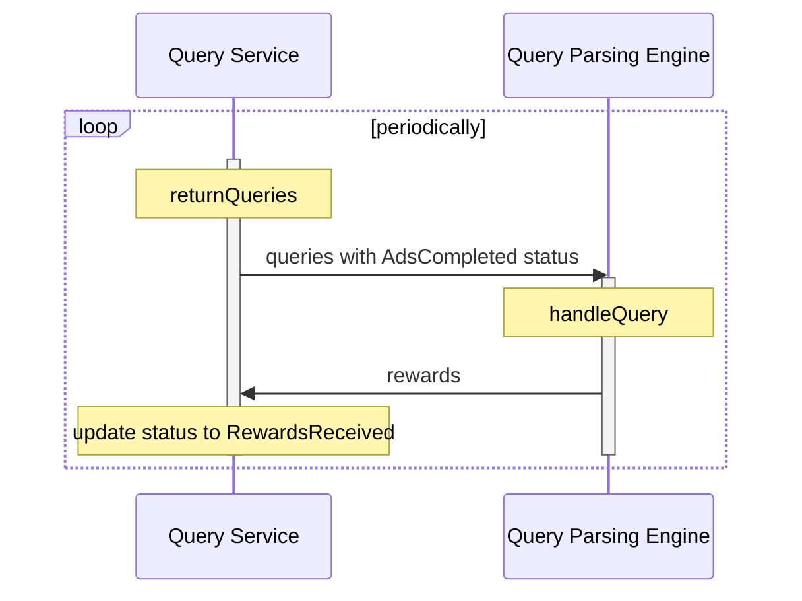
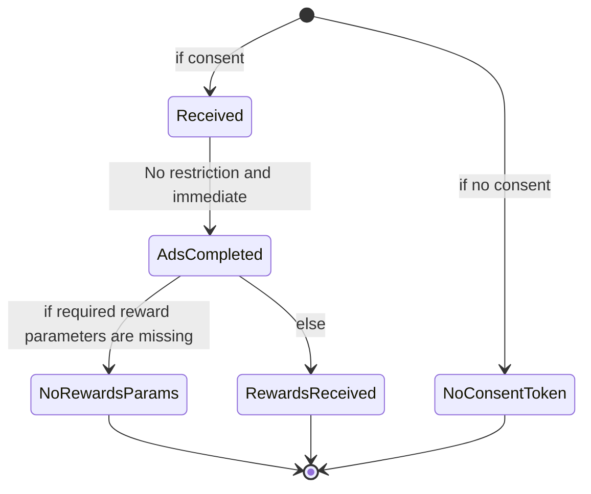

## Objective
Queries can have Ads. When it has Ads, we wait till the expiration of the query (**with a grace period**) to collect as many ad signatures as possible. This process is complicated as should be extracted to a process class.

## Evaluate Compensation Pre-conditions

Either one of the following must be TRUE before we can evaluate the compensations of a query

1. No Ads
2. No **time** to wait for Ads (grace period is over)
3. Have required signatures

## Sequence Diagram
The execution process is a multi-step asynchronous process. First, when a query is available on blockchain, the blockchain listener initiates the scheduling of the query. This process creates a QueryStatus object for the query. Second, there is a periodic process that processes all the queries with the status EQueryProcessingStatus.AdsCompleted for insights and rewards. 

Essentially, all the queries with Received status will transformed into AdsCompleted status before insights and rewards are processed.

### 1. Scheduling Queries

### 2. Processing Insights and Rewards

## Query Status
