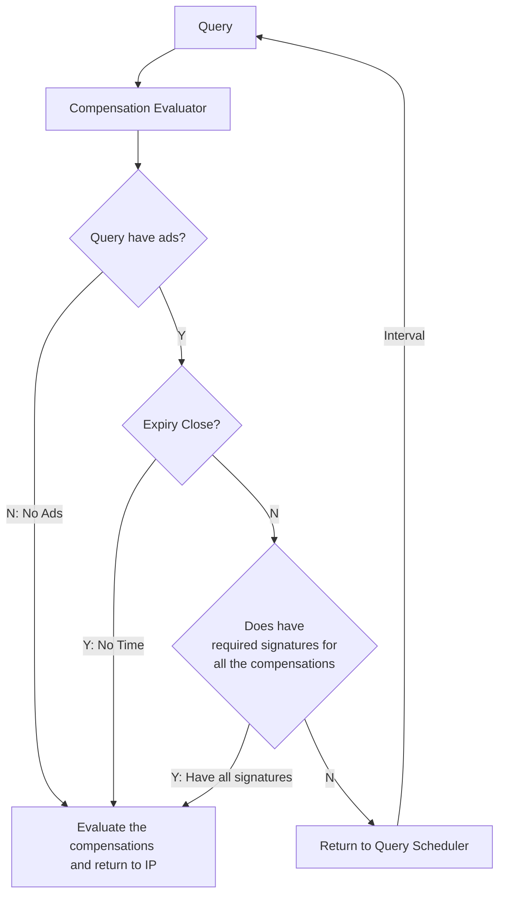

## Objective
Queries can have Ads. When it has Ads, we wait till the expiration of the query (**with a grace period**) to collect as many ad signatures as possible. This process is complicated as should be extracted to a process class.

## Evaluate Compensation Pre-conditions

Either one of the following must be TRUE before we can evaluate the compensations of a query

1. No Ads
2. No **time** to wait for Ads (grace period is over)
3. Have required signatures