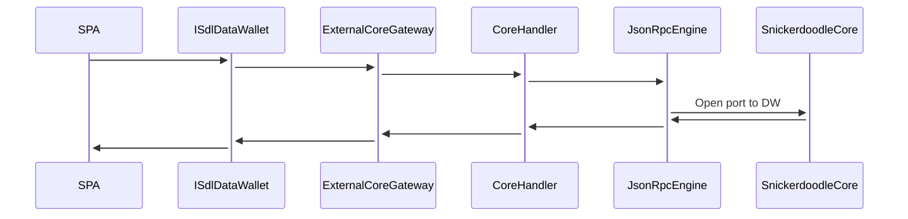

# SPA-Data Wallet Communication
Extension on boarding is a single page application (SPA) that communicates with the data wallet for various purposes. The communication between the SPA and the data wallet is not direct, that is, SPA does not have direct access to the methods of data wallet. 

Indirect communication is facilitated via an open port over which SPA can fire **rpc events**, representing a function call made to the [SnickerdoodleCore class](./../../packages/core/src/implementations/SnickerdoodleCore.ts).

The Core class is the only open gate to data wallet for the SPA, and SPA will only have access to methods of core, that are also defined in [ISdlDataWallet](./../../packages/objects/src/interfaces/ISdlDataWallet.ts). ISdlDataWallet is a **gateway interface**, implemented by synamint-extension-sdk package: [_DataWalletProxy](./../../packages/synamint-extension-sdk/src/content/DataWalletProxy.ts).

For each function call from SPA, proxy implementation directs this function call event to [ExternalCoreGateway](./../../packages/synamint-extension-sdk/src/gateways/ExternalCoreGateway.ts). ExternalCoreGateway then contains a [CoreHandler](./../../packages/synamint-extension-sdk/src/gateways/handler/CoreHandler.ts), which is just a wrapper for a JsonRpcEngine that handles the call to the data wallet.

The _DataWalletProxy proxy implementation is then injected into the window object by synamint-extension-sdk package, and can be accessed by anywhere the window object is accessable.



# Example
We have a new "DiscordService" in data wallet that handles Discord-related calls to outside.
```
    @injectable()
	export class DiscordService implements IDiscordService {
  	public constructor(
    @inject(IConfigProviderType) protected configProvider: IConfigProvider,
    @inject(IDiscordRepositoryType) public discordRepo: IDiscordRepository,
  ) {}

    public getUserProfiles(): ResultAsync<DiscordProfile[], PersistenceError> {
    return this.discordRepo.getUserProfiles();
  	}
  }

```
1. First, we add our service to the [SnickerdoodleCore](./../../packages/core/src/implementations/SnickerdoodleCore.ts) because SnickerdoodleCore follows a **service repository** pattern. This file is the main registry for the core package methods. 

    This project also uses **inversion of dependencies**, so we'll first need to register our new service to the global umbrella.

    In order to do this we will bind the discord service to its interface in [SnickerdoodleCore.module](./../../packages/core/src/implementations/SnickerdoodleCore.module.ts).

    ```
        export const snickerdoodleCoreModule = new ContainerModule(
      ...
        bind<IDiscordService>(IDiscordServiceType)
            .to(DiscordService)
            .inSingletonScope();
          )
    ```
    After that we can use it in [SnickerdoodleCore](./../../packages/core/src/implementations/SnickerdoodleCore.ts)
    ```
    const discordService = this.iocContainer.get<IDiscordService>(IDiscordServiceType);
    discordService.someMethod(args);
    ```

    SnickerdoodleCore must also contain the functions that are supposed to be exposed to outside. These methods will fetch the discordService as a varialbe (as shown above) and call a method from that.

    There are different ways to add your methods into the core. What matters is it must appear as a function in this class somehow. Consider following code where new methods are put in the core class in the form of a "discord" object:

    ```
    export class SnickerdoodleCore implements ISnickerdoodleCore {
      protected iocContainer: Container;

      public marketplace: ICoreMarketplaceMethods;
      public integration: ICoreIntegrationMethods;
      public discord : ICoreDiscordMethods;

      public constructor(
        configOverrides?: IConfigOverrides,
        storageUtils?: IStorageUtils,
        volatileStorage?: IVolatileStorage,
        cloudStorage?: ICloudStorage,
      ) {
          this.discord = {
            getUserProfiles : () => {
              const discordService = this.iocContainer.get<IDiscordService>(IDiscordServiceType);
              return discordService.getUserProfiles();
            },
          }
      }
        
    ```

    Updating the core also means the core interface [ISnickerdoodleCore](./../../packages/objects/src/interfaces/SnickerdoodleCore.ts) must be updated.
    ```
    export interface ISnickerdoodleCore {
    discord : ICoreDiscordMethods;
    }
    export interface ICoreDiscordMethods {
        getUserProfiles(): ResultAsync<DiscordProfile[], PersistenceError>
    }
    ```


2. Now that we added the our service to core package it is time to update the synamint-extension-sdk package. This package has an event associated with each function call that can be made to Core. All these events are in [actions](./../../packages/synamint-extension-sdk/src/shared/enums/actions.ts). 

    We now add our new action to EExternalActions ENUM. If we need more than one type of function calls, we'll need to make an addition for all of them.
    ```
    export enum EExternalActions {
      GET_DISCORD_USER_PROFILES = "GET_DISCORD_USER_PROFILES",
    }

    ```
    We follow the same service repository approach on synamint-extension-sdk package, and that's why we will have to add a new discord service with interfaces to this package as well. Only purpose of the new discord service would be to call the core package, but if needed you could add some logic as well such as cookies to store data.
    ```
      @injectable()
      export class DiscordService implements IDiscordService {
        constructor(
          @inject(IDiscordRepositoryType)
          protected discordRepository: IDiscordRepository,
        ) {}
            getUserProfiles(): ResultAsync<DiscordProfile[], SnickerDoodleCoreError> {
            return this.discordRepository.getUserProfiles();
        }
      }
    ```

    A point of difference for our new methods is that they now abstract their error interfaces as SnickerDoodleCoreError, this way we don't have import the core error interfaces but of course we will relay the error messages 

    ```
      @injectable()
      export class DiscordRepository implements IDiscordRepository {
        constructor(
          @inject(ISnickerdoodleCoreType) protected core: ISnickerdoodleCore,
          @inject(IErrorUtilsType) protected errorUtils: IErrorUtils,
        ) {}
        getUserProfiles(): ResultAsync<DiscordProfile[], SnickerDoodleCoreError> {
          return this.core.discord.getUserProfiles().mapErr((error) => {
            this.errorUtils.emit(error);
            return new SnickerDoodleCoreError((error as Error).message, error);
          });
        }
      }
    ```

    We will add our new services to the [ExtensionCore.module](./../../packages/synamint-extension-sdk/src/core/implementations/ExtensionCore.module.ts) 

    ```
    export const extensionCoreModule = new ContainerModule(
      bind<IDiscordService>(IDiscordServiceType)
        .to(DiscordService)
        .inSingletonScope();
        
      bind<IDiscordRepository>(IDiscordRepositoryType)
        .to(DiscordRepository)
        .inSingletonScope();
    )
    ```

    Now we are ready to use our new discord service with our new event. The events are handled at [RpcCallHandler](./../../packages/synamint-extension-sdk/src/core/implementations/api/RpcCallHandler.ts), each event is handled in a switch case at handleRpcCall method.

    ```
    @injectable()
    export class RpcCallHandler implements IRpcCallHandler {
      constructor(
        protected discordService: IDiscordService,
      ) {}

      public async handleRpcCall(
        req: JsonRpcRequest<unknown>,
        res: PendingJsonRpcResponse<unknown>,
        next: AsyncJsonRpcEngineNextCallback,
        sender: Runtime.MessageSender | undefined,
      ) {
        const { method, params } = req;
        switch (method) {
          case EExternalActions.GET_DISCORD_GUILD_PROFILES : {
            return new AsyncRpcResponseSender(
              this.discordService.getGuildProfiles(),
              res,
            ).call();
          }
        }
      }
    }
    ```

3. Now we will add our new methods to the gateway that spa uses to make calls. Since we added an external action we will use the  [ExternalCoreGateway](./../../packages/synamint-extension-sdk/src/gateways/ExternalCoreGateway.ts) methods. Before that we will have to add new interfaces though. [ISdlDataWallet](./../../packages/objects/src/interfaces/ISdlDataWallet.ts), this is the main interface for the communication methods and the type of the injected object that the data wallet makes. SPA will use theses methods when making a call.

    ```
    type JsonRpcError = unknown;
    export interface ISdlDataWallet extends EventEmitter {
      discord : ISdlDiscordMethods
    }

    export interface ISdlDiscordMethods {
      getUserProfiles(): ResultAsync<DiscordProfile[], JsonRpcError>;
    }
    ```

    Notice we changed our error type yet again, for similar reasons as the previous one. Now we are ready to add our new methods to the gateway

    ```
    export class ExternalCoreGateway {
      protected _handler: CoreHandler;
      discord : ISdlDiscordMethods;
      constructor(protected rpcEngine: JsonRpcEngine) {
        this._handler = new CoreHandler(rpcEngine);
        this.discord = {
            getUserProfiles :(): ResultAsync<DiscordProfile[], JsonRpcError> => {
              return this._handler.call(EExternalActions.GET_DISCORD_USER_PROFILES);
            }
        }
      }
    }
    ```

    SPA now can call the defined methods from core. An example call is as follows, and here a front-end component calls the proxy directly.

    ```
    declare const window: IWindowWithSdlDataWallet;
    const DiscordMediaData: FC<ISocialMediaDataItemProps> = ({
      name,
      icon,
    }: ISocialMediaDataItemProps) => {
      public getUserProfiles(): ResultAsync<DiscordProfile[], unknown> {
        return window.sdlDataWallet.discord.getUserProfiles().mapErr(() => {
          return errAsync(new Error("Could not get discord user profiles!"));
        });
      }
    }
    ```

    Creating an additional **DiscordService** and **DiscordRepository** for the SPA is a better practice to handle these kinds of situations. Components are then abstracted from the calls.

