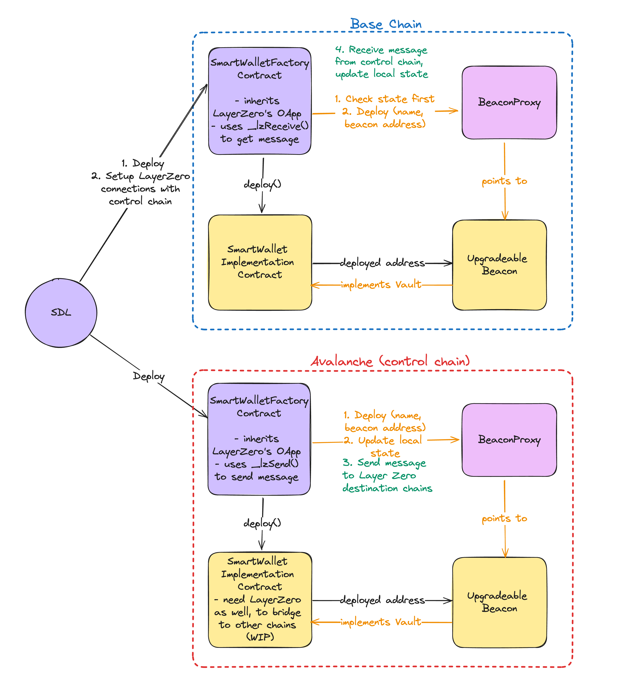

# Snickerdoodle Protocol Contracts Package

## Package Contents

- [contracts](/packages/contracts/contracts/): Subdirectory containing all Snickerdoodle Protocol smart contracts
- [docs](/packages/contracts/docs/): Auto-generated API documentation of public and external contract methods
- [scripts](/packages/contracts/scripts/): Hardhat [scripts](https://hardhat.org/guides/scripts.html) for deploying different configurations of the smart contract stack
- [tasks](/packages/contracts/tasks/): Hardhat [task definitions](https://hardhat.org/guides/create-task.html) for interacting with smart contract deployments
- [test](/packages/contracts/test/): Hardhat [unit tests](https://hardhat.org/guides/waffle-testing.html) for the Snickerdoodle Protocol smart contract stack
- [hardhat.config.js](/packages/contracts/hardhat.config.js): [Configuration file](https://hardhat.org/config/) for the Hardhat development framework

## Summary

The Snickerdoodle Contracts stack consists of the following primary components:

### [ad-wallet](/packages/contracts/contracts/user-wallet/README.md)

Contains ad wallet contracts

### [user-wallet](/packages/contracts/contracts/user-wallet/README.md)

Contains the upgradable smart wallet implementation and an associated Layer Zero featured contract factory.

### [governance](/packages/contracts/contracts/governance/README.md)

Contains the implementation of the Snickerdoodle Protocol governance DAO.

### Install Dependencies

Steps to install and run this project this locally:

```shell
git clone https://github.com/SnickerdoodleLabs/protocol.git
cd protocol
yarn install
```

### Compiling Contracts

Use Hardhat to compile the protocol contracts like this:

```shell
cd /packages/contracts
yarn compile
yarn test
```

This command will create a subdirectory called `artifacts` which will contain the contract [ABI](https://docs.soliditylang.org/en/v0.8.13/abi-spec.html) and bytecode for all contracts in the `contracts` subdirectory.

### Docker

A pre-built docker image for local development against the contract stack is available at
[`snickerdoodlelabs/devchain`](https://hub.docker.com/repository/docker/snickerdoodlelabs/devchain).
Run a local subnet like this:

```shell
docker run -d -p 8545:8545 --rm snickerdoodlelabs/devchain
```

Run a [Hardhat node](https://hardhat.org/hardhat-network/docs/overview) like this:

```shell
docker run -d -p 8569:8569 --name devchain --rm --env NETWORK=dev snickerdoodlelabs/devchain
```

## Deployment Addresses

A list of Snickerdoodle Protocol contract addresses can be found [here](/packages/contracts/DEPLOYMENTS.md).


# User Smart Wallet

Layer Zero's OApps (Omnichain Apps) allow us to send messages between contracts on different chains. By having the Smart Wallet contracts inherits the OApp, it allows the Smart Wallet contracts deployed on different chains to update each other's states via messages. Below is a diagram of how the Smart Wallet contracts work.



For this example, we will deploy SmartWalletFactory contracts on the Fuji testnet to Amoy testnet. SmartWalletFactory contracts inherits the OApp contract based on the Layer Zero's (LZ) V2 implementation [here](https://docs.layerzero.network/v2/developers/evm/oapp/overview).

Both contracts will be similar so that we would be able to send and receive messages between them (ie. they both have the same LZ sending and receiving implementations).

Start by cloning the repo and installing the dependencies. 

```sh
git clone https://github.com/SnickerdoodleLabs/smart-wallet-example.git
cd smart-wallet-example
npm install
```

NOTE: Before proceeding, make necessary `.env` updates with the private key of the signing account and fund the accounts with native tokens of the chains to be tested on in this example.