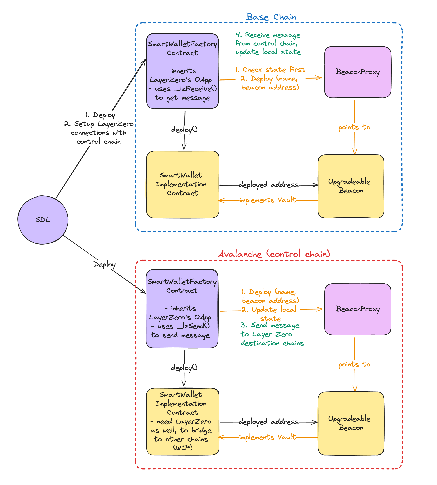

# Testing SmartWalletFactory (with Hardhat Tasks)

## Introduction

Layer Zero's OApps (Omnichain Apps) allow us to send messages between contracts on different chains. By having the Smart Wallet contracts inherits the OApp, it allows the Smart Wallet contracts deployed on different chains to update each other's states via messages. Below is a diagram of how the Smart Wallet contracts work.



At the time of writing, it is not possible to perform local unit testing due to the following reasons.
- There is currently not support for testing LayerZero contracts with 2 different chains.
- LayerZero's mocks only differentiates the source and destination contracts via mock endpoint ids. The contracts themselves are all deployed on the same Hardhat chain.
- As the goal is to have the same smart wallet contract addresses deployed on various EVM chains using `create2`, it is not possible to replicate this implementation when testing on a single Hardhat chain. 

Hence, this README walks through an example of how the contracts can be tested on testnets.

## Testing steps
For this example, we will deploy SmartWalletFactory contracts on the Fuji testnet to Amoy testnet. SmartWalletFactory contracts inherits the OApp contract based on the Layer Zero's (LZ) V2 implementation [here](https://docs.layerzero.network/v2/developers/evm/oapp/overview).

Both contracts will be similar so that we would be able to send and receive messages between them (ie. they both have the same LZ sending and receiving implementations).

Start by cloning the repo and installing the dependencies.

```sh
git clone https://github.com/SnickerdoodleLabs/protocol.git
cd protocol
yarn 
cd packages/contracts
```
1. Make necessary `.env` updates with the private key of the signing account and fund the accounts with Fuji AVAX and Amoy MATIC tokens.
2. Set the correct the LZ endpoint address and owner params before each contract deployments in the [SmartWalletFactory.ts](/ignition/modules/SmartWalletFactory.ts#L6) file. The list of endpoint values can be found [here](https://docs.layerzero.network/v2/developers/evm/technical-reference/deployed-contracts).
3. Once the params are correctly set, deploy the SmartWalletFactory to Fuji and Amoy testnets:
   ```shell
   npx hardhat ignition deploy ignition/modules/SmartWalletFactory.ts --network fuji --strategy create2 --reset
   ```

   Expected output:
   ```shell
   Deployed Addresses

   SmartWalletModule#SmartWalletFactory - 0x21F1dfE03B5157B4A77d162337d82a936aCD05D8
   ```

    ```shell
    npx hardhat ignition deploy ignition/modules/SmartWalletFactory.ts --network amoy --strategy create2 --reset
    ```

   Expected output:
   ```shell
   Deployed Addresses

   SmartWalletModule#SmartWalletFactory - 0x21F1dfE03B5157B4A77d162337d82a936aCD05D8
   ```
   Because we deployed using the create2 strategy, it should produce the same contract addresses on both chains. 

   Sample SmartWalletFactory addresses deployed on [Fuji](https://testnet.snowtrace.io/address/0x21F1dfE03B5157B4A77d162337d82a936aCD05D8) and [Amoy](https://amoy.polygonscan.com/address/0x21F1dfE03B5157B4A77d162337d82a936aCD05D8): `0x21F1dfE03B5157B4A77d162337d82a936aCD05D8`

3. Update the `SMART_WALLET_FACTORY` in [smartWallet.ts](/tasks/smartWallet.ts#L3) with the newly deployed contract address for the Hardhat tasks to work correctly.

4. We then need to call `setPeer` to connect the contracts together. The list of endpoint values can be found [here](https://docs.layerzero.network/v2/developers/evm/technical-reference/deployed-contracts). We need to do this step for all destination chain ids we want to connect.

   The respective peer contract addresses are the contract addresses deployed above.

    - Amoy's endpoint id is `40267`
    - Fuji's endpoint id is `40106`

   Call `setPeer` on the Fuji contract to point to the Amoy contract:
   ```shell
   npx hardhat smartWalletFactorySetPeer --currentcontract 0x21F1dfE03B5157B4A77d162337d82a936aCD05D8 --peercontract 0x21F1dfE03B5157B4A77d162337d82a936aCD05D8 --eid 40267 --network fuji
   ```
   Call `setPeer` on the Amoy contract to point to the Fuji contract:

   ```shell
   npx hardhat smartWalletFactorySetPeer --currentcontract 0x21F1dfE03B5157B4A77d162337d82a936aCD05D8 --peercontract 0x21F1dfE03B5157B4A77d162337d82a936aCD05D8 --eid 40106 --network amoy
   ```
   
5. Try deploying a smart wallet on the destination chain. We expect to see an error that says it has not deployed the wallet on the source chain.
    ``` shell
    npx hardhat deploySmartWalletUpgradeableBeacon --name MYSMARTWALLET --owner 0xBaea3282Cd6d44672EA12Eb6434ED1d1d4b615C7 --network amoy
    ```
   Expected output:

    ``` shell
    ...ProviderError: execution reverted: SmartWalletFactory: Smart wallet with selected name has not been created on the source chain
    ```

5. Deploy a smart wallet on the source chain. 
    ``` shell
    npx hardhat deploySmartWalletUpgradeableBeacon --name MYSMARTWALLET --owner 0xBaea3282Cd6d44672EA12Eb6434ED1d1d4b615C7 --network fuji
    ```
    Expected output:

    ``` shell
    Smart wallet deployed!
    ```

6. Compute the smart wallet proxy address for a given name.
    ``` shell
	npx hardhat computeSmartWalletProxyAddress --name MYSMARTWALLET --network fuji
	```
    Expected output:

    ``` shell
	Proxy Address: 0x622DC353688ae8168400A2De185fE8808474872E
	```
7.  We can confirm that the owner matches the deployed and computed proxy address.

    ``` shell
    npx hardhat getOwnerOfSmartWallet --smartwalletaddress 0x622DC353688ae8168400A2De185fE8808474872E --network fuji
    ```
    Expected output:

    ``` shell
    Owner address: 0xBaea3282Cd6d44672EA12Eb6434ED1d1d4b615C7
	```

8.  Before claiming the wallet on the destination chain, we get a quote of the fees to send that message from our source chain.
    ``` shell
    npx hardhat quoteClaimSmartWalletOnDestinationChain --destinationchainid 40267 --owner 0xBaea3282Cd6d44672EA12Eb6434ED1d1d4b615C7 --smartwalletaddress 0x622DC353688ae8168400A2De185fE8808474872E --network fuji
    ```
    Expected output:

    ``` shell
    Quoted price: [ 9137755207124937n, 0n ]
	```

8.  Now, we initiate a layer zero call from the source to the destination chain to claim the wallet on the destination chain. Using the quote above as the fee in wei. If the transaction is successful, Layer Zero will also send a message to the destination chain to update the owner of the smart wallet address.
    
    If the user tried with a wallet name that has not been deployed against the owner address, it will error out.
    ``` shell
    npx hardhat claimSmartWalletAddressOnDestinationChain --destinationchaineid 40267 --walletname WRONGWALLETNAME --owner 0xBaea3282Cd6d44672EA12Eb6434ED1d1d4b615C7 --feeinwei 9137755207124937 --network fuji
    ```
    Expected output:

    ``` shell
    ...ProviderError: execution reverted: SmartWalletFactory: Owner provided has not deployed wallet with provided name
	```
    Trying again with the correct wallet name...
    ``` shell
    npx hardhat claimSmartWalletAddressOnDestinationChain --destinationchaineid 40267 --walletname MYSMARTWALLET --owner 0xBaea3282Cd6d44672EA12Eb6434ED1d1d4b615C7 --feeinwei 9137755207124937 --network fuji
    ```
    Expected output:

    ``` shell
    Wallet claimed request submitted to destination chain! Txhash: 0x1bc38650c0a04e2fd49fbd85ba37e9f868e25f256f9a2c6240c5f2e68061fe83
	```

9. Using the transaction hash, check the status of the message sent to LZ (and ultimately to the contract on Mumbai) via the scanner like [this](https://testnet.layerzeroscan.com/tx/0x1bc38650c0a04e2fd49fbd85ba37e9f868e25f256f9a2c6240c5f2e68061fe83). This process took about 2 minutes to reach the complete status.
10. Repeat the smart wallet ownership check on the source and destination chains to confirm that Layer Zero has updated the destination chain's status.

	``` shell
    npx hardhat getOwnerOfSmartWallet --smartwalletaddress 0x622DC353688ae8168400A2De185fE8808474872E --network fuji
    ```

    Expected output: 
    
    ``` shell
    Owner address: 0xBaea3282Cd6d44672EA12Eb6434ED1d1d4b615C7
    ```
    
    Running this command gets the owner of the smart wallet address on the Amoy contract.
    ``` shell
    npx hardhat getOwnerOfSmartWallet --smartwalletaddress 0x622DC353688ae8168400A2De185fE8808474872E --network amoy
    ```
    Expected output: 
    
    ``` shell
    Owner address: 0xBaea3282Cd6d44672EA12Eb6434ED1d1d4b615C7
    ```

11. Finally, we can now create a smart wallet on the destination chain.

    ``` shell
    npx hardhat deploySmartWalletUpgradeableBeacon --name MYSMARTWALLET --owner 0xBaea3282Cd6d44672EA12Eb6434ED1d1d4b615C7 --network amoy
    ```
    Expected output:
    
     ``` shell
     Smart wallet deployed!
     ```
12. Optional : We can also use the event checker script to confirm the deployed proxy address. Setup the correct params like block number (using the output from the step 7) to target the correct SmartWalletCreated event
   ``` shell
   npx hardhat run scripts/getPastEvents.ts  
   ```
   
   Expected output:
   ``` shell
    Fetching events from block 11028897 to 11028997...
    Found 1 event(s):
    Event 1:
        Smart Wallet Address: 0x622DC353688ae8168400A2De185fE8808474872E
        Block Number: 11028997
        Transaction Hash: 0x988bc3cbbb305b7e026585f72f6af30f095f7443a13b58b9175b9586018d839e
        Log Index: undefined
   ```
    
