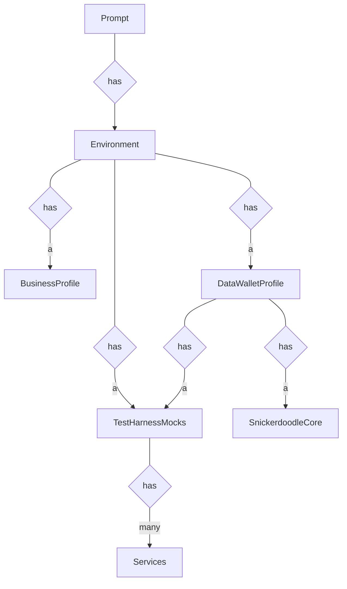
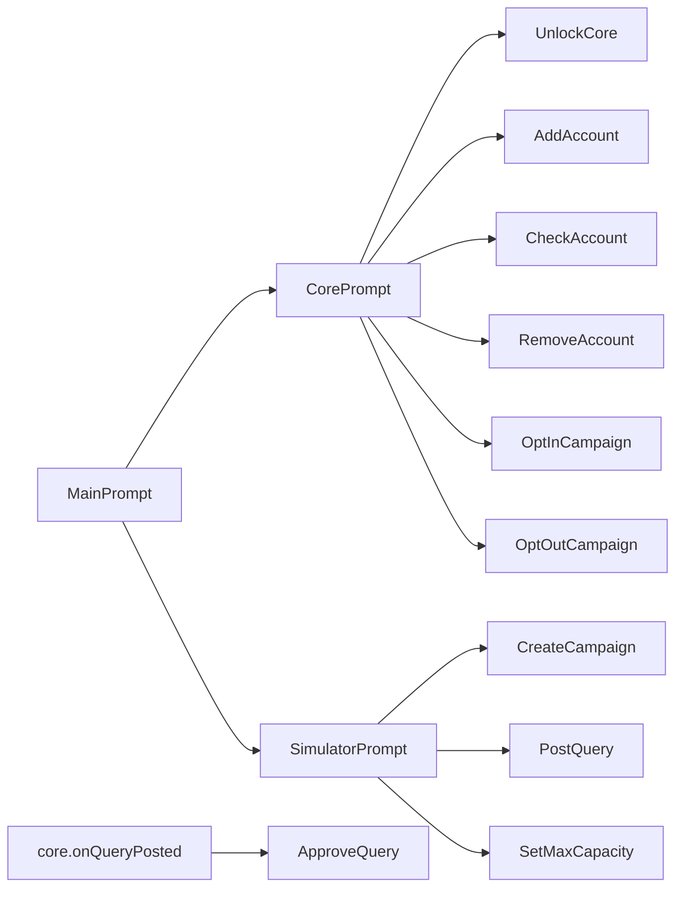

# Architecture of the Console Application for dynamic scenario testing.

## Components

## Prompt map

## Initialization code

The interactive console app is created by the [PromptFactory](../src/utilities/PromptFactory.ts) class. It initializes the core and attaches event listeners. 

## Where to keep mocks:
The [TestHarnessMocks](../src/mocks/TestHarnessMocks.ts) hosts all the mocked data and services that are not specific to a business / datawallet profile.

DataWallet related sample data/ops should go to DataWalletProfile class, and Business related sample data/ops should go to BusinessProfile class.